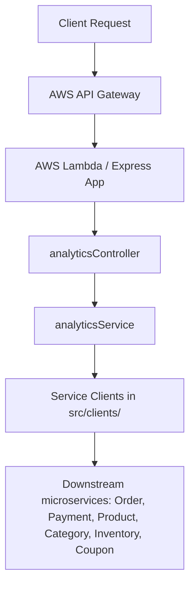

# Analytics Service

The Analytics Service is a high-performance, read-only analytics microservice built for the Tech E-Commerce Platform. It integrates seamlessly with existing services (Products, Orders, Inventory, Payments, Coupons, Categories) by retrieving data through robust HTTP API clients and performing in-memory aggregations.

The service is fully ready for AWS Lambda deployment using the Serverless Framework.

---

## Architecture Overview

This service adheres to the exact **MVC (Model-View-Controller)** pattern and **Service Layer Architecture** used in the other backend microservices.



### Decoupled Data Aggregation Strategy
- **No Direct Table Writes**: The Analytics Service strictly performs **READ** operations. It never alters business data.
- **Connection Keep-Alive**: Axios clients reuse TCP sockets via HTTP/HTTPS agents to reduce latency.
- **Concurrent API Calls**: The service utilizes `Promise.all()` to pull datasets concurrently from downstream services, preventing blockages.
- **In-Memory Map/Set Aggregations**: Aggregation routines use Javascript `Map` and `Set` to execute loops in $O(N)$ time complexity rather than nested $O(N^2)$ checks.

---

## Folder Explanation

```
analytics-service/
├── src/
│   ├── clients/        # Axios clients for service-to-service communication
│   ├── config/         # App & cognito configs
│   ├── constants/      # Constants (reusable metrics keys, status enums)
│   ├── controllers/    # API controllers mapping parameters and forwarding to services
│   ├── middleware/     # Cognito auth, roles check, 404, and error handlers
│   ├── routes/         # Router declarations mapping request paths to controllers
│   ├── services/       # Core aggregation service functions
│   ├── utils/          # JWT Token verifier, custom response handler
│   └── app.js          # Express app configuration
├── .env.example        # Environment variable templates
├── lambda.js           # Serverless handler (wraps Express with serverless-http)
├── package.json        # Service metadata and packages dependencies
├── server.js           # Local express server startup script
└── serverless.yml      # Serverless deployment configuration
```

---

## Environment Variables

Copy `.env.example` to `.env` and configure:

| Variable | Description | Default (Dev) |
| --- | --- | --- |
| `PORT` | Local Express Server port | `5008` |
| `NODE_ENV` | Application environment | `development` |
| `SERVICE_NAME` | Service name identifier | `analytics-service` |
| `AWS_REGION` | AWS regional deployment | `ap-southeast-1` |
| `COGNITO_USER_POOL_ID` | Cognito User Pool ID | *Provided* |
| `COGNITO_CLIENT_ID` | Cognito Client ID | *Provided* |
| `INTERNAL_SERVICE_KEY` | Service-to-service authentication key | `my-super-secret-key-123` |
| `PRODUCT_SERVICE_URL` | Downstream URL for Product Service | `http://localhost:5001` |
| `CATEGORY_SERVICE_URL` | Downstream URL for Category Service | `http://localhost:5006` |
| `ORDER_SERVICE_URL` | Downstream URL for Order Service | `http://localhost:5003` |
| `PAYMENT_SERVICE_URL` | Downstream URL for Payment Service | `http://localhost:5004` |
| `INVENTORY_SERVICE_URL` | Downstream URL for Inventory Service | `http://localhost:5005` |
| `COUPON_SERVICE_URL` | Downstream URL for Coupon Service | `http://localhost:5006` |

---

## API Documentation

All endpoints (except `/health`) require an Authorization header: `Bearer <Cognito_Admin_JWT_Token>`.

### 1. Health Endpoint
- **URL**: `GET /api/v1/analytics/health`
- **Auth**: Public
- **Description**: Returns latency times and connectivity health for all downstream microservices.
- **Response**:
  ```json
  {
    "success": true,
    "data": {
      "status": "Healthy",
      "connectedServices": [
        { "service": "Order Service", "status": "Healthy", "responseTimeMs": 14 },
        { "service": "Product Service", "status": "Healthy", "responseTimeMs": 11 }
      ],
      "responseTimeMs": 28,
      "version": "1.0.0",
      "timestamp": "2026-07-19T22:38:00.000Z"
    }
  }
  ```

### 2. General Dashboard
- **URL**: `GET /api/v1/analytics/dashboard`
- **Auth**: Admin Only
- **Description**: Aggregates total metrics (revenue, order status counts, stock summary, payments methods, catalog counts).

### 3. Revenue Analytics
- **URL**: `GET /api/v1/analytics/revenue`
- **Auth**: Admin Only
- **Query Params**: `period` (values: `today`, `yesterday`, `last7days`, `last30days`, `month`, `year`, `custom`), `startDate` (ISO String), `endDate` (ISO String).
- **Description**: Detailed timeline breakdown of revenue metrics.

### 4. Orders Analytics
- **URL**: `GET /api/v1/analytics/orders`
- **Auth**: Admin Only
- **Description**: Totals, completed/pending/cancelled ratios, AOV, and timeline order volume trends.

### 5. Products Performance
- **URL**: `GET /api/v1/analytics/products`
- **Auth**: Admin Only
- **Description**: Lists top-selling, least-selling, highest-revenue products, and remaining warehouse inventory.

### 6. Category Performance
- **URL**: `GET /api/v1/analytics/categories`
- **Auth**: Admin Only
- **Description**: Volume units sold and revenue totals broken down per product category.

### 7. Coupon Usage
- **URL**: `GET /api/v1/analytics/coupons`
- **Auth**: Admin Only
- **Description**: Coupon redemption counts, success/failure rates, discount savings.

### 8. Inventory Summary
- **URL**: `GET /api/v1/analytics/inventory`
- **Auth**: Admin Only
- **Description**: Total, reserved, sold, low stock, and out-of-stock count aggregations.

### 9. Payments Analysis
- **URL**: `GET /api/v1/analytics/payments`
- **Auth**: Admin Only
- **Description**: Transaction methods breakdown (UPI, Card, COD, Wallet) and statuses counts.

---

## Setup & Running Locally

1. Install dependencies:
   ```bash
   cd analytics-service
   npm install
   ```
2. Set up your `.env` configuration file:
   ```bash
   cp .env.example .env
   ```
3. Run in development hot-reload mode:
   ```bash
   npm run dev
   ```

---

## Deployment Guide

We use the Serverless Framework to deploy to AWS. Ensure your AWS credentials profile is configured.

```bash
# Deploy to dev stage
npx serverless deploy --stage dev
```

---

## Testing Guide

### Manual Integration Test
Run these requests using a REST client (or curl) pointing to local server at `http://localhost:5008`:

```bash
# 1. Check health
curl http://localhost:5008/api/v1/analytics/health

# 2. Get dashboard statistics (Requires JWT Token)
curl -H "Authorization: Bearer <ADMIN_JWT_TOKEN>" http://localhost:5008/api/v1/analytics/dashboard
```
